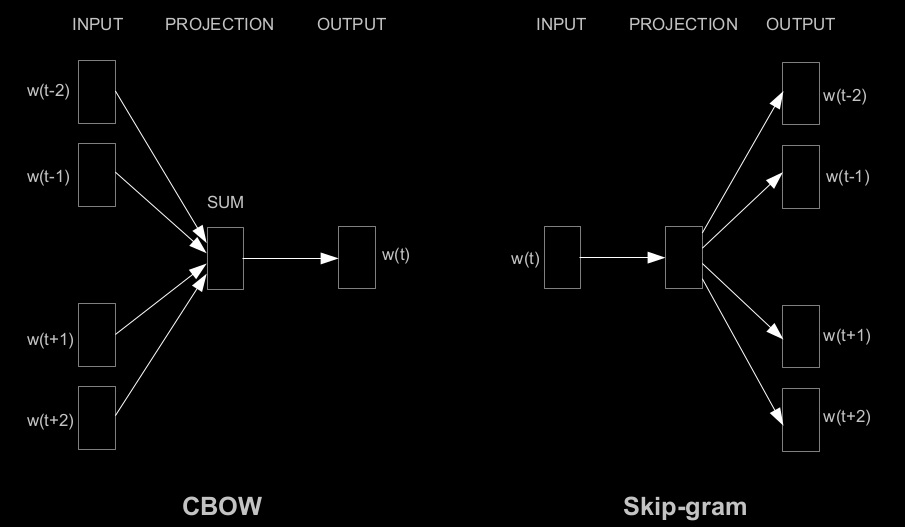

# Efficient Estimation of Word Representations in Vector Space
## - Google: Tomas Mikolov, Kai Chen

The research paper focuses on the development and evaluation of techniques for learning high-quality word vectors from large datasets containing billions of words.

The paper presents two novel model architectures: `Continuous Bag-of-Words` (CBOW) and `Skip-gram`. CBOW predicts the current word based on context, while Skip-gram predicts surrounding words given the current word. These architectures leverage neural networks for efficient learning of word representations.

- The training methodology involves stochastic gradient descent and backpropagation with linearly decreasing learning rates, using Adabatch

# Continuous Bag-of-Words Model
We try to predict a word, given its neighbouring words.

# Continuous Skip gram model
we use each current word as an input to a log-linear classifier with continuous projection layer, and predict words within a certain range before and after the current word.

