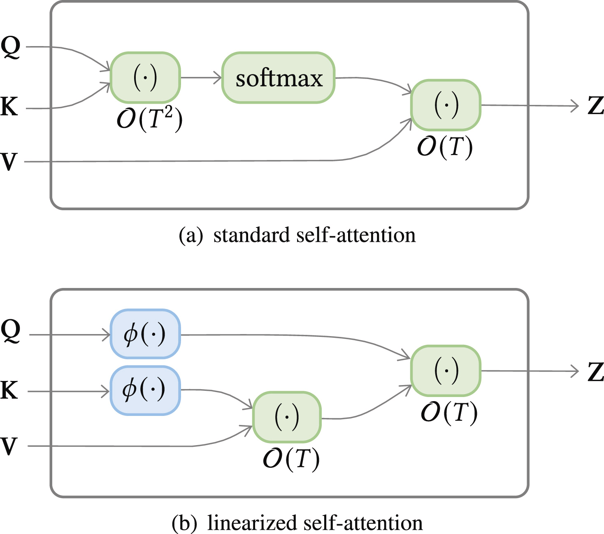

# A survey on Transformers
### - Tianyang Lin, Yuxin Wang , Xiangyang Li, Xipeng Qiu
https://www.sciencedirect.com/science/article/pii/S2666651022000146#sec1

# Introduction
- X-former is a term often used as shorthand for transformer
- The vanilla transformer has improved over time for:
  - Improved model efficiency - Computation and memory
  - Model Generalization
  - Model Adaptation - On other tasks

# Vanilla Transformer
- The vanilla Transformer is a sequence-to-sequence model and consists of an encoder and a decoder, each of which is a stack of N identical blocks.
- Each encoder block is mainly composed of a multi-head self-attention module and a position-wise feed-forward network (FFN). 
- For building a deeper model, a residual connection is employed around each module, followed by Layer Normalization module. 
- Compared to the encoder blocks, decoder blocks additionally insert cross-attention modules between the multi-head self-attention modules and the position-wise FFNs. 
- Furthermore, the self-attention modules in the decoder are adapted to prevent each position from attending to subsequent positions. 

## Types of Transformers
Three types of transformers:
1. Encoder only transformer
2. Decoder only transformer
3. Encoder-Decoder transformer

## Attention
Three types of attention:
1. Self-attention - in encoder to learn about input
2. Masked self-attention - in decoder(at the start) to do self-attention wihout looking into the future tokens(helpful in training)
3. Cross-attention - Uses encoder's Q and K with decoder's V matrix to decide attention values.

## Inductive bias
- Transformer is often compared against convolutional and recurrent networks.
- Convolutional networks are known to impose the inductive biases of translation invariance and locality with shared local kernel functions.
- Similarly, recurrent networks carry the inductive biases of temporal invariance and locality via their Markovian structure.
- On the other hand, the Transformer architecture makes few assumptions about structural information of data. 
This makes Transformer a universal and flexible architecture. 
As a side effect, the lack of structural bias makes Transformer prone to overfitting for small-scale data.

# Modification to vanilla transformers

# 1. Improvements on attention mechanism
1. Sparse Attention: Every token doesn't attends to every other token
   - Introduces sparsity bias into the attention mechanism, leading to reduced complexity.
   - Incorporates structural bias to limit the number of query–key pairs that each query attends to.
   - Two Types:
       1. Position-based sparse attention: Absence of connection is based on the position (pre-defined patterns)
         - Atomic attention: Any of the following
           
         - Compound sparse attention: Combination of the above atomic attentions
           
         - Extended sparse attention
           
       
       2. Content-based sparse attention: 
         - Another technique is to create a sparse graph based on input content
         - Includes Reformer, Sparse Adaptive Connection, Sparse Sinkhorn Attention

2. Linearized Attention. 
This line of work disentangles the attention matrix with kernel feature maps. 
The attention is then computed in reversed order to achieve linear complexity.
At the cost of being faster, it faces a loss in expressiveness and accuracy

3. Query prototype and Memory Compression. This class of methods reduces the number of queries or key–value memory pairs to reduce the size of the attention matrix.
   - Attention with prototype queries: Several prototypes of queries serve as the main source to compute attention distributions.
   - Attention with compressed key–value memory: Reduce the complexity by reducing the number of the key–value pairs before applying the attention mechanism

4. Low-rank Self-Attention - Reduce the computational and memory complexity of the self-attention mechanism in transformers by approximating the attention matrix using low-rank factorization
   - Low-rank parameterization
   - Low-rank approximation

5. Attention with Prior - The line of research explores supplementing or substituting standard attention with prior attention distributions.

6. Improved Multi-Head Mechanism. Multi-head attention is appealing for the ability to jointly attend to information from different representation subspaces at different positions. However, there is no mechanism to guarantee that different attention heads indeed capture distinct features.
   - **Head behavior modeling**: Line of work is dedicated to improving multi-head mechanism by introducing incorporating more sophisticated mechanisms that guide the behavior of different attention heads or allow interaction across attention heads.
   - **Multi-head with restricted spans**: Different heads attend to local and broader spans. This can boost efficiency and locality information.
   Restricting attention spans can be expressed as multiplying each attention distribution value with a mask value and then re-normalize.
   - **Multi-head with refined aggregation**: After multi-head attention, vanilla transformers concatenates up the representations and then applies a linear transformation. This might not  fully exploit the expressiveness of multi-head attention and that it is more desirable to use a more complex aggregation. Also, there are routing techniqes(dynamic, EM) that can do this.
   - **Other modifications**: Includes
     - Multi-query attention: where key–value pairs are shared among attention heads
     - Small attention key size can affect its ability to represent arbitrary distribution. It is observed empirically that setting attention head size to be input sequence length is beneficial.

# 2. Improvements to Positional Representations
1. Absolute position representations
2. Relative position representation
3. Other representations
4. Position representations without explicit encoding
5. Position representation on Transformer decoders

# 3. Improvements to Layer Normalization
1. Placement of layer normalization
2. Substitutes of layer normalization
3. Normalization-free Transformer

## 4. Fully Connected Network
1. Activation function in FFN
2. Adapting FFN for larger capacity
3. Dropping FFN layers

# Architecture-level variants 
# Pre-trained Transformers