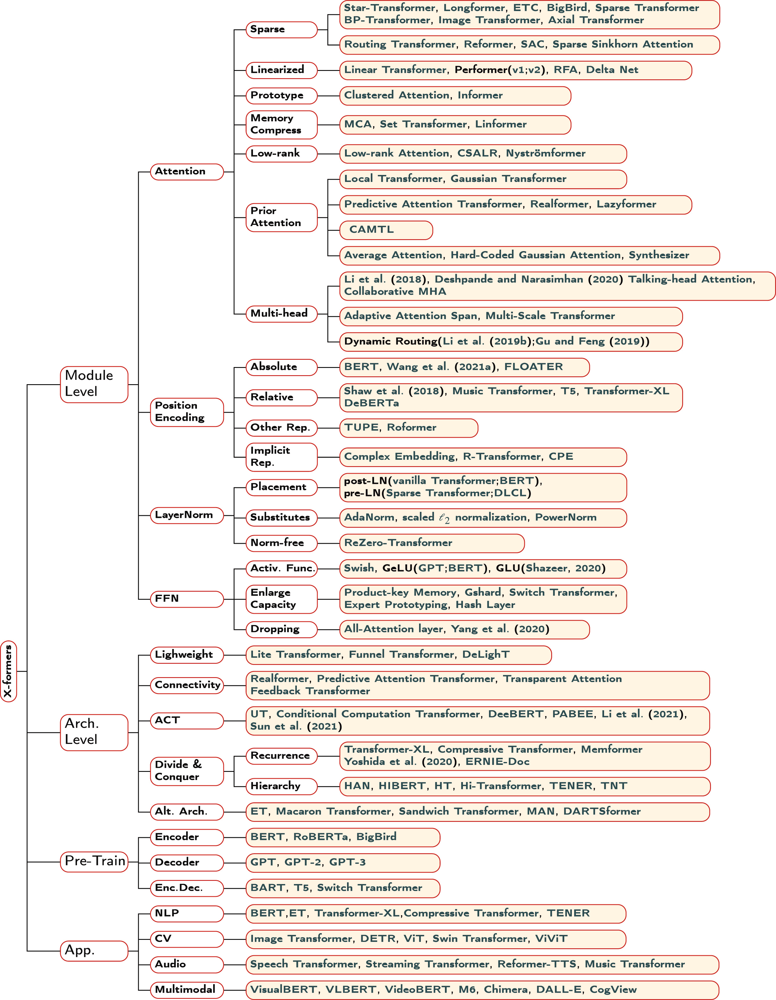
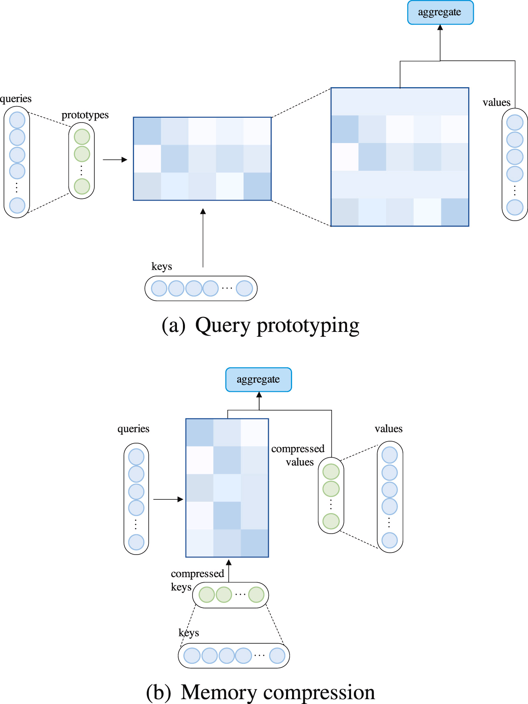
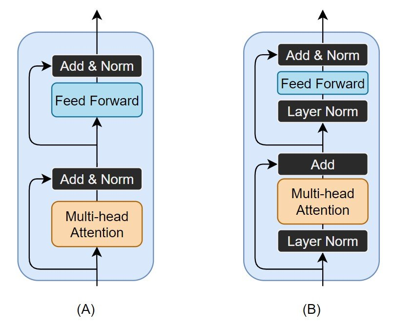
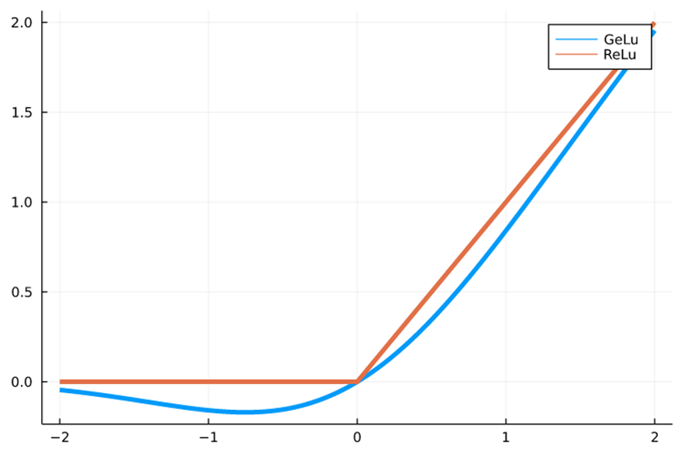
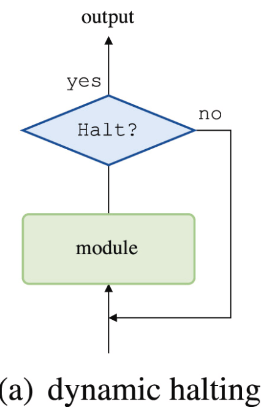

# A survey on Transformers
### - Tianyang Lin, Yuxin Wang , Xiangyang Li, Xipeng Qiu
https://arxiv.org/abs/2106.04554

# Introduction
- X-former is a term often used as shorthand for transformer
- The vanilla transformer has improved over time for:
  - Improved model efficiency - Computation and memory
  - Model Generalization
  - Model Adaptation - On other tasks

# Vanilla Transformer
- The vanilla Transformer is a sequence-to-sequence model and consists of an encoder and a decoder, each of which is a stack of N identical blocks.
- Each encoder block is mainly composed of a multi-head self-attention module and a position-wise feed-forward network (FFN). 
- For building a deeper model, a residual connection is employed around each module, followed by Layer Normalization module. 
- Compared to the encoder blocks, decoder blocks additionally insert cross-attention modules between the multi-head self-attention modules and the position-wise FFNs. 
- Furthermore, the self-attention modules in the decoder are adapted to prevent each position from attending to subsequent positions. 

## Types of Transformers
Three types of transformers:
1. Encoder only transformer
2. Decoder only transformer
3. Encoder-Decoder transformer

## Attention
Three types of attention:
1. Self-attention - in encoder to learn about input
2. Masked self-attention - in decoder(at the start) to do self-attention wihout looking into the future tokens(helpful in training)
3. Cross-attention - Uses encoder's Q and K with decoder's V matrix to decide attention values.

## Inductive bias
- Transformer is often compared against convolutional and recurrent networks.
- Convolutional networks are known to impose the inductive biases of translation invariance and locality with shared local kernel functions.
- Similarly, recurrent networks carry the inductive biases of temporal invariance and locality via their Markovian structure.
- On the other hand, the Transformer architecture makes few assumptions about structural information of data. 
This makes Transformer a universal and flexible architecture. 
As a side effect, the lack of structural bias makes Transformer prone to overfitting for small-scale data.

# Modification to vanilla transformers

# 1. Improvements on attention mechanism
1. Sparse Attention: Every token doesn't attends to every other token
   - Introduces sparsity bias into the attention mechanism, leading to reduced complexity.
   - Incorporates structural bias to limit the number of query–key pairs that each query attends to.
   - Two Types:
       1. Position-based sparse attention: Absence of connection is based on the position (pre-defined patterns)
         - Atomic attention: Any of the following
           
         - Compound sparse attention: Combination of the above atomic attentions
           
         - Extended sparse attention
           
       
       2. Content-based sparse attention: 
         - Another technique is to create a sparse graph based on input content
         - Includes Reformer, Sparse Adaptive Connection, Sparse Sinkhorn Attention

2. Linearized Attention. 
This line of work disentangles the attention matrix with kernel feature maps. 
The attention is then computed in reversed order to achieve linear complexity.
At the cost of being faster, it faces a loss in expressiveness and accuracy

3. Query prototype and Memory Compression. This class of methods reduces the number of queries or key–value memory pairs to reduce the size of the attention matrix.
   - Attention with prototype queries: Several prototypes of queries serve as the main source to compute attention distributions.
   - Attention with compressed key–value memory: Reduce the complexity by reducing the number of the key–value pairs before applying the attention mechanism

4. Low-rank Self-Attention - Reduce the computational and memory complexity of the self-attention mechanism in transformers by approximating the attention matrix using low-rank factorization
   - Low-rank parameterization
   - Low-rank approximation

5. Attention with Prior - The line of research explores supplementing or substituting standard attention with prior attention distributions.

6. Improved Multi-Head Mechanism. Multi-head attention is appealing for the ability to jointly attend to information from different representation subspaces at different positions. However, there is no mechanism to guarantee that different attention heads indeed capture distinct features.
   - **Head behavior modeling**: Line of work is dedicated to improving multi-head mechanism by introducing incorporating more sophisticated mechanisms that guide the behavior of different attention heads or allow interaction across attention heads.
   - **Multi-head with restricted spans**: Different heads attend to local and broader spans. This can boost efficiency and locality information.
   Restricting attention spans can be expressed as multiplying each attention distribution value with a mask value and then re-normalize.
   - **Multi-head with refined aggregation**: After multi-head attention, vanilla transformers concatenates up the representations and then applies a linear transformation. This might not  fully exploit the expressiveness of multi-head attention and that it is more desirable to use a more complex aggregation. Also, there are routing techniqes(dynamic, EM) that can do this.
   - **Other modifications**: Includes
     - Multi-query attention: where key–value pairs are shared among attention heads
     - Small attention key size can affect its ability to represent arbitrary distribution. It is observed empirically that setting attention head size to be input sequence length is beneficial.

# 2. Improvements to Positional Representations
1. Absolute position representations
   - In vanilla transformer, positional information is encoded as absolute sinusoidal position encodings
   - Another way of representing absolute positions is to learn a set of positional embeddings for each position. This works bad when the sequence length is large, but there are even ways around that.
   - Later works find it beneficial to add position representations to inputs to each Transformer layer, not to token just to embeddings.

2. Relative position representation
   - Another line of works focuses on representing positional relationships between tokens instead of positions of individual tokens. 

3. Other representations
   - Some research studies have explored using hybrid positional representations that contains both absolute and relative positional information.
   - **Rotary Position Embedding (RoPE)**: RoPE is designed to encode relative positions instead of absolute positions, which helps the model generalize better to longer sequences and adapt to various sequence lengths. It uses a form of absolute embedding but can capture relative positional relations.
 
4. Position representations without explicit encoding: Another idea is to encode positional information in word embeddings. 

5. Position representation on Transformer decoders: A model that exploits only the decoder of Transformer has the potential of sensing positional information without incorporating explicit positional representation, bacause they are trained autoregressively with masked attention. 

# 3. Improvements to Layer Normalization
1. Placement of layer normalization:
   - There are two types of placement of Layer Normalisation(LN):
   
     1. Pre-Layer Normalization (Pre-LN)
        - Layer normalization is applied before the sublayers (self-attention and feed-forward layers).
        - `Output=Sublayer(LayerNorm(x))+x`
        - Better Gradient Flow(faster training), Easier Convergence, no warmup steps required
        - Reduced Expressiveness(might limit the sublayer's ability to manipulate the activations)
     2. Post-Layer Normalization (Post-LN)
        - Layer normalization is applied after the sublayers (self-attention and feed-forward layers).
        - `Output=LayerNorm(Sublayer(x)+x)`
        - This was the original architecture as per Attention is all you need
        - Although Post-LN often results in unstable training and divergence, it usually outperforms pre-LN variants after convergence
        - Training Instability, Vanishing Gradient Issues, Requires Warmup steps for ensuring stability
        - A proper initialization can guarantee stable gradients and better performance
2. Substitutes of layer normalization
   - Xu et al. (2019) empirically observe that the learnable parameters in the LN module do not work in most experiments, and even increase the risk of overfitting. They further conclude from controlled experiments that the forward normalization is not the reason why LN works for Transformer. From analysis and experiments, it is concluded that the derivatives of the mean and variance re-center and re-scale the gradients and play a significant role in LN. They thus propose AdaNorm, a normalization technique without learnable parameters
   - PowerNorm (PN) that has three modifications over Batch Norm:
     1. it relaxes the zero-mean normalization; 
     2. it uses the quadratic mean of the signal, instead of the variance; 
     3. it uses running statistics for the quadratic mean, instead of using per-batch statistics.
3. Normalization-free Transformer
  - ReZero replace LN module with a learnable residual connection
  - Replacing LN in Transformer with ReZero mechanism is verified to induce better dynamic isometry for input signals and leads to faster convergence.

## 4. Fully Connected Network
1. Activation function in FFN
   1. ReLU
      -  `ReLU(x) = max(0,x)`
      -  Vanilla transformers uses Relu
   2. Swish function
      - `Swish(x)=x⋅σ(x)`
      - observe that it consistently improve performance on WMT 2014 dataset.
   3. Gaussian Error Linear Unit (GELU)
      - `GELU(x)=x⋅Φ(x)`
      - 
      - Used in GPT
      - It has now become a default practice to use this
   4. Gated Linear Units (GLU)
      - `GLU(x)=(x⋅W1) ⊙ σ(x⋅W2)` # ⊙ is element wise multiplication
      - introduces a gating mechanism to control the flow of information through the network
      - Helps the model to filter information and learn complex pattern
      - GLU variants consistently improve vanilla Transformer with ReLU activation

2. Adapting FFN for larger capacity
   - replace some of the FFNs with the product-key memory layers
   - sparsely-gated **Mixture of Experts** layers to replace FFNs in Transformer. Each MoE layer consists of several FFNs (each called an expert) that are the same structure as position-wise FFNs in vanilla Transformer. The output of the layer is a weighted sum of the outputs of the FFNs, using gate values computed by a routing function `𝑔(⋅)`. They design a learnable routing function that assigns tokens to experts, with auxiliary loss to satisfy balanced loads between experts and efficiency at the scale of length such that the experts can be distributed across multiple devices. For each forward pass of the MoE layer, only the experts with top-𝑘 gate values are activated.
   - Switch Transformer proposes to route using only a single expert with the largest gate value, leading to a much smaller computational footprint. It is reported to speed up pre-training by a large margin compared to the non-MoE counterpart while having a similar number of FLOPS.
   - hash layers show competitive results with existing methods such as Switch Transformer with no routing parameters or any auxiliary loss function
  
3. Dropping FFN layers
   - replacing the ReLU activation with Softmax and dropping the bias term in FFN effectively turns FFN into an attention module where position-wise inputs attend to a global key-value memory. This approach simplifies the structure of the network with no loss of performance.
   - Another paper empirically show that FFNs in the decoder of Transformer, despite its large number of parameters, is not efficient and can be removed safely with only slight or no loss of performance. This approach significantly boosts the training and inference speed.

# Architecture-level variants
1. Lightweight transformers
   - `Lite Transformer`(suitable for mobile devices) proposes to replace each attention module in Transformer with a two-branch structure, where one branch uses attention to capture long-range contexts while the other branch uses depth-wise convolution and linear layers to capture local dependencies
   - `Funnel Transformer` utilizes a funnel-like encoder architecture where the length of the hidden sequence is gradually reduced using pooling along the sequence dimension, and then recovered using up-sampling. Reduces FLOPS and memory.
   - `DeLighT` replaces the standard Transformer block with DeLighT block.
     They also propose a block-wise scaling strategy that allows for shallower and narrower blocks near the input and wider and deeper blocks near the output.
     The induced network is much deeper than the vanilla Transformer but with fewer parameters and operations.
     The DeLighT block includes
        1. a “expand-and-reduce” DeLighT transformation module to learn wider representations with low computation requirements
        2. a single-head self-attention to learn pair-wise interaction; 
        3. a lightweight “reduce-and-expand” FFN.     

2. Strengthening cross-block connectivity
   - Realformer and Predictive Attention Transformer reuses attention distributions from previous block to guide attention of current block. This can be seen as creating a forward path between adjacent Transformer blocks.
   - In a `Deep Transformer encoder–decoder` model, the cross-attention modules in the decoder only utilize the final outputs of the encoder, therefore the error signal will have to traverse along the depth of the encoder (potential gradient issues)
   - `Transparent Attention` uses a weighted sum of encoder representations at all encoder layers (including the embedding layer) in each cross-attention module.
   - `Feedback Transformer` proposes to add a feedback mechanism to Transformer decoder, where each position attends to a weighted sum of history representations from all layers

3. Adaptive computation time
   - An intriguing and promising modification is to make computation time conditioned on the inputs - to introduce Adaptive Computation Time (ACT) into Transformer models. 
   - `Universal Transformer` (UT) incorporates a recurrence-over-depth mechanism that iteratively refines representations for all symbols using a module that is shared over depth
   
   - `Conditional Computation Transformer` adds a gating module at each self-attention and feed-forward layer to decide whether to skip the current layer
   
   - There is a line of work dedicated to adapting the number of layers to each input in order to achieve a good speed-accuracy trade-off, which is called `early exit mechanism`
   

4. Transformers with divide-and-conquer strategies
   
   1. Recurrent Transformers
      - In recurrent Transformers, a cache memory is maintained to incorporate the history information.
      - `Transformer-XL` address the limitation of a fixed length context by caching representations from the previous segment and reuse it as an extended context when the model processes the current segment.
      - `Compressive Transformer` extends this idea further by extending the cache with two levels of memory
      - `Memformer`  extends the recurrence mechanism from decoder-only architecture to an encoder–decoder architecture
   2. Hierarchical Transformers
      - Low-level features are first fed to a Transformer encoder, producing output representations that are then aggregated (using pooling or other operations) to form a high-level feature, which is then processed by a high-level Transformer. 
      - Hierarchical modeling allows the model to handle long inputs with limited resources
      - It has the potential to generate richer representations that are beneficial to tasks.

5. Exploring alternative architecture
   - One research interpret Transformer as a numerical Ordinary Differential Equation (ODE) solver for a convection–diffusion equation in a multi-particle dynamic system and design Macaron Transformer, which replaces each Transformer block with a FFN-attention-FFN variant.
   - Sandwich Transformer explores reorganizing attention modules and FFN modules such that attention modules are mainly located in lower layers and FFN modules in upper layers. The induced model improves perplexity on multiple languages.
   - Mask Attention Network (MAN) 
   - Notably, there is a line of work that uses Neural Architecture Search (NAS) to search for alternative Transformer architectures.
     - The Evolved Transformer (ET)employs evolution-based architecture search with the standard Transformer architecture seeding the initial population. The searched model demonstrates consistent improvement over Transformer on several language tasks.

# Pre-trained Transformers
Unlike convolutional neural networks (CNNs) that assume spatial locality in images (nearby pixels are related) or recurrent neural networks (RNNs) that assume temporal dependencies (previous elements influence future elements), transformers do not make such assumptions.
This can be good(let transformers learn anything) or bad(overfit on the given data).
