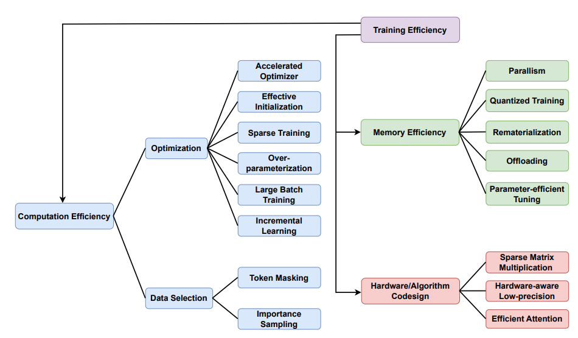

# A Survey on Efficient Training of Transformers
http://arxiv.org/abs/2302.01107

# Intro
- Paper is a survey on training transformers
- As paramter count increases, the need for effective training mechanism also increases
  - to reduce cost
  - faster training
  - Environmental concerns

# 3 ways to achieve efficient training

## 1. Computational efficiency
- Optimizer
  - SGD: classic, not every efficient
  - Adam: combines momentum and Adaptive Learning Rates
  - AdamW: Decouples weight decay from optimisation step
    - reccomended over adam
    - Weight decay is applied directly to the parameters before the optimization step.
  - Lion: (EvoLved Sign Momentum)
    - recent optimiser that keeps track of only momentum with first order gradient
    - claimed to be memory efficient than Adam

- Initialization
  - T-Fixup is a normalization-free initialization method designed to improve the training stability of deep transformers without relying on techniques like layer normalization or gradient clipping
  - Fixup

- Sparse Training
- Overparameterisation
  - It is observed that overparameterization empirically improves both convergence and generalization, with theoretical guarantee though not sufficient.
- Large batch size
- Incremental learning
  - The high-level concept of incremental learning is relaxing the original challenging optimization problem into a sequence of easy-to-optimize sub-problems, where thessolution of one sub-problem can serve as a good initialization to the subsequent one to circumventsthe training difficulty, in analogy with annealing.
- Token masking.
- Importance sampling/ data pruning
  
# Memory Efficiency
- Parallelism
  - Data Parallelism (DP) which distributes a minibatch of data across different devices
    - DP itself is only suitable for training small to moderate models
  - Model Parallelism (MP) which allocates subgraphs of a model across multiple workers.
    - Tensor Parallelism (TP)
    - Pipeline Parallelism (PP) 
- Quantized training 
  - quantized training trains neural networks from scratch in reduced precision by compressing the activations/weights/gradients into low-bit values
  - automatic mixed-precision - AMP stores a master copy of weights in full-precision for updates while the activations, gradients and weights are stored in FP16 for arithmetic.
- Rematerialization and offloading
- Parameter-efficient tuning

# Hardware/Algorithm Co-design
- Efficient attention
- Hardware-aware low-precision
- Sparse matrix multiplication

