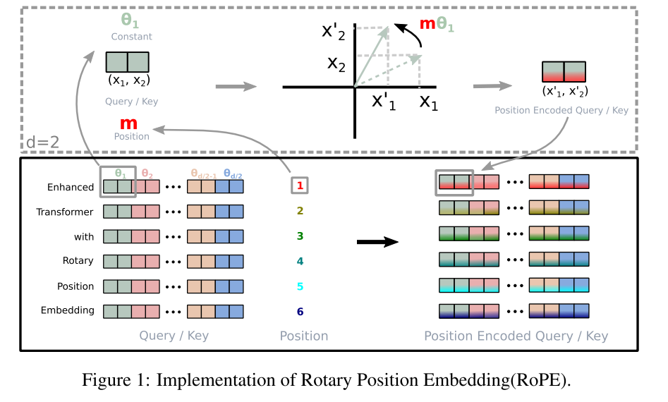

# ROFORMER: ENHANCED TRANSFORMER WITH ROTARY POSITION EMBEDDING

- Jianlin Su, Yu Lu: Nov 2023

# Introduction
- Introduces RoPE(Rotary positional embeddings)
- Roformer is a transformer that uses RoPE 
- used in modern LLMs like gemma, llama, GPT-Neo, GPT-J, GPT-NeoX, etc.
- better suited for large context lengths and long-sequence tasks.
- better than sinusodial PE or learnable PE in most tasks(mainly the ones that require higher context)
- requires modifying the attention mechanism
- Instead of adding a positional vector, it applies a rotation to the word vector. 

# Previous Positional Embeddings

- Rather than focusing on a token’s absolute position in a sentence, relative positional embeddings concentrate on the distances between pairs of tokens
- Absolute positional embeddings assign a unique vector to each position, which though straightforward, doesn’t scale well and fails to capture relative positions effectively. Relative embeddings, on the other hand, focus on the distance between tokens, enhancing the model’s understanding of token relationships but complicating the model architecture. 

# Working
- Typicall PEs add the position information in context representation
- But, RoPE encodes the `absolute position with a rotation matrix` and incorporates the `explicit relative position dependency in self-attention formulation`.
- RoPE ingeniously combines the strengths of both absolute and relational PEs. It encodes positional information in a way that allows the model to understand both the absolute position of tokens and their relative distances. This is achieved through a rotational mechanism, where each position in the sequence is represented by a rotation in the embedding space. The elegance of RoPE lies in its simplicity and efficiency, enabling models to better grasp the nuances of language syntax and semantics.
-  To encode its position in a sentence, RoPE rotates this vector. The angle of rotation (θ) is proportional to the word’s position in the sentence. For instance, the vector is rotated by θ for the first position, 2θ for the second, and so on. 
-  For higher dimensions, the vector is split into 2D chunks, and each pair is rotated independently.
-  In RoPE, the positional encoding is based on rotations applied to the query and key vectors during the attention mechanism, and this rotation introduces a relative positional shift. While RoPE is effective for handling both absolute and relative positional information, the term "long-term decay" is often used to describe how the impact of positional encodings weakens as the distance between tokens increases.
- rotation(linear transformation) of Q, K matrices is used to store some sort of positional information

# Reference
- https://medium.com/ai-insights-cobet/rotary-positional-embeddings-a-detailed-look-and-comprehensive-understanding-4ff66a874d83