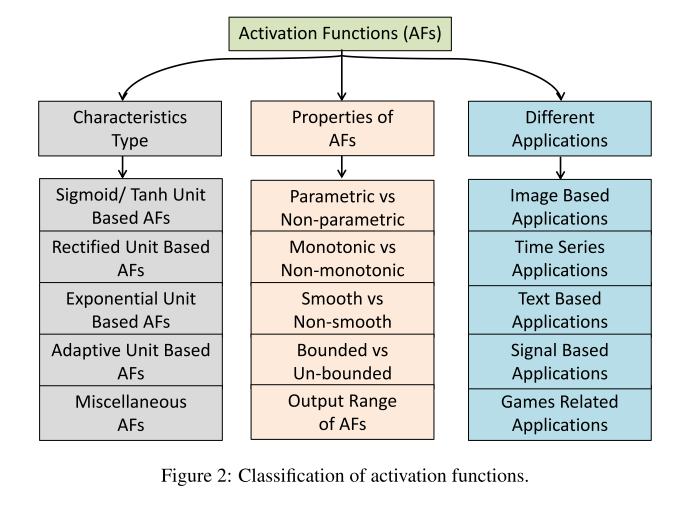

# Activation Functions in Deep Learning: A Comprehensive Survey and Benchmark

Shiv Ram Dubey1, Satish Kumar Singh1, Bidyut Baran Chaudhur

- the main goal of any neural network is to transform
the non-linearly separable input data into more linearly separable abstract features using a hierarchy of layers.
- normalising and standarising is very important for most AFs

        Despite the ReLU being a popular choice, recently proposed AFs such as Swish, Mish, and PAU are also worth trying for different problems.

- The ReLU, LReLU, ELU, GELU, CELU, and PDELU
functions are better for the networks having residual con-
nections for image classification.

• The exponential AFs generally lead to the increased non-
linearity due to utilization of the negative values.

• The Tanh and SELU AFs are found better for language
translation along with PReLU, LiSHT, SRS and PAU.

- It is suggested to use the PReLU, GELU, Swish, Mish and PAU activation function for speech recognition.

1. Sigmoid
- used in initial days
- faced vanishing gradient problem
- poor convergence
- squashes to (0,1)
1. tanh function
- exhibited zero centric property, better convergence
- squashes to [-1,1]
- Tanh function is computationally inefficient because it involves the computa-
tion of exponential multiple times

1. ReLU
- simple, high performance
- relu(x) = max(0,x)
-Various variants
of ReLU have been investigated by tackling its drawbacks, such
as non-utilization of negative values, limited non-linearity and
unbounded output 

4. PReLu
- Parametric ReLU
- the slope for negative input as a trainable parameter
- 
- Better than relu in many cases
- However, it can lead to overfitting easily which is the down-
side of PReLU.
- 
5. 
6. Exponential Unit Based Activation Functions
- proper utilisation of large + and -ve numbers
- The Exponential Linear Unit (ELU) [27] based AF utilizes the negative
values with the help of the exponential function.
 
1. Learning/Adaptive Activation FunctionsLearning/Adaptive Activation Functions:
- contains learnable parameters
- can work on very complex problems
- more expensive
- 
1. 
2. 
3. 
4. 
5.  
6.  