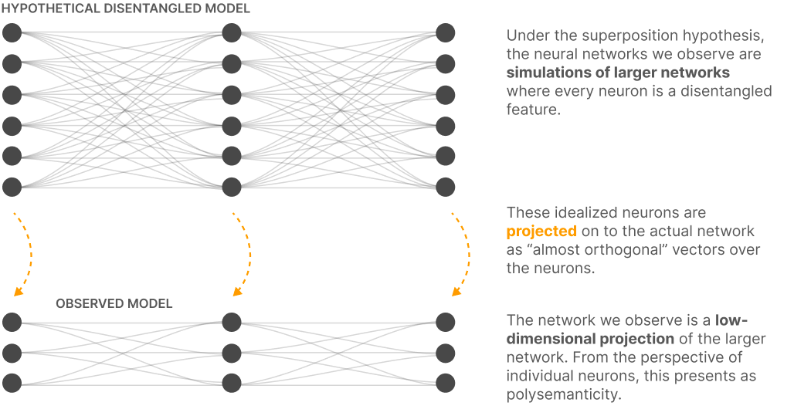

# Towards Monosemanticity: Decomposing Language Models With Dictionary Learning
- Antropic, 2023

`The key idea of this paper is to use a SAE to try to understand what each neuron in the MLP layer of a one-layer transformer mean(like, what vague concept does each neuron refer to.).`

The goal of this paper is to make features disentangled. This means that each feature should refer to a single key idea. Also a the neurons that activate when we talk about this feature should be the same.

- A feature is a linear direction in activation space that corresponds to a meaningful concept or property (e.g., "cat," "negation," or "striped texture"). Features are often represented as linear combinations of neurons, meaning they are distributed across multiple neurons rather than being tied to a single one.

- The Monosemanticity paper aims to find and understand the features that a neural network encodes in its activations. These features are conceptualized as linear combinations of neurons in the network, rather than being tied to individual neurons.

- Objective of the Paper:
    - To identify these features in the network's latent space.
    - To analyze whether these features can be made monosemantic (representing one interpretable concept without ambiguity).
    - To study and potentially reduce superposition, where multiple features overlap in the same neurons or directions.

- the superposition hypothesis postulates that neural networks “want to represent more features than they have neurons”

- This is because many neurons are `polysemantic`: they respond to mixtures of seemingly unrelated inputs. We use the SAE to make them monosemantic. During training of a NN, each feature is learned as a linear combinatoin of neurons(instead of each neuron correspoding to a feature). This makes it hard to understand what each neuron means.
- The most important claim of our paper is that dictionary learning can extract features that are significantly more monosemantic than neurons

- In Toy Models of Superposition, we described three strategies to finding a sparse and interpretable set of features if they are indeed hidden by superposition: (1) creating models without superposition, perhaps by encouraging activation sparsity; (2) using dictionary learning to find an overcomplete feature basis in a model exhibiting superposition; and (3) hybrid approaches relying on a combination of the two. Since the publication of that work, we've explored all three approaches. We eventually developed counterexamples which persuaded us that the sparse architectural approach (approach 1) was insufficient to prevent polysemanticity, and that standard dictionary learning methods (approach 2) had significant issues with overfitting.
- the authors found that sparsity (like using 1-hot activations) can remove superposition, but it doesn't necessarily resolve polysemanticity. Even when neurons are not sharing features (no superposition), they can still ambiguously represent multiple features, making it hard to achieve clear, interpretable behaviors.
- 

## Monosemanticity
Monosemanticity refers to the property of a component (e.g., a neuron or a feature) in a model having a single, clear, and interpretable meaning or functionality. A monosemantic component responds consistently to one type of input or encodes one specific concept, making it easier to understand and predict its behavior.

- we use a weak dictionary learning algorithm called a sparse autoencoder to generate learned features from a trained model that offer a more monosemantic unit of analysis than the model's neurons themselves

Results
- Sparse Autoencoders extract relatively monosemantic features very well.
- Sparse autoencoders produce relatively universal features.
- Features appear to "split" as we increase autoencoder size.

# Autoencoders
- In toy models we found that the bias terms were quite important to the autoencoder’s performance
- Our sparse autoencoder is a model with a bias at the input, a linear layer with bias and ReLU for the encoder, and then another linear layer and bias for the decoder.
-  Adam optimizer
-  MSE loss plus an L1 penalty to encourage sparsity.
-  We found that training the autoencoder on more data made features subjectively “sharper” and more interpretable.  usedA 8 billion training points
-  Second, we found that over the course of training some neurons cease to activate, even across a large number of datapoints. We found that “resampling” these dead neurons during training gave better results by allowing the model to represent more features for a given autoencoder hidden layer dimension. in brief we periodically check for neurons which have not fired in a significant number of steps and reset the encoder weights on the dead neurons to match data points that the autoencoder does not currently represent well
-  Usually in machine learning we can quite easily tell if a method is working by looking at an easily-measured quantity like the test loss. We spent quite some time searching for an equivalent metric to guide our efforts here, and unfortunately have yet to find anything satisfactory.
-  Thus we ended up using a combination of several additional metrics to guide our investigations:
    - Manual inspection: Do the features seem interpretable?
    - Feature density: we found that the number of “live” features and the percentage of tokens on which they fire to be an extremely useful guide. (See appendix for details.)
    - Reconstruction loss: How well does the autoencoder reconstruct the MLP activations? Our goal is ultimately to explain the function of the MLP layer, so the MSE loss should be low.
    - Toy models: Having toy models where we know the ground truth and so can cleanly evaluate the autoencoder’s performance was crucial to our early progress.

`It is very hard to interpret the working of one neuron, but much easier to interpret the working of a feature(which is a bunch of neurons).`