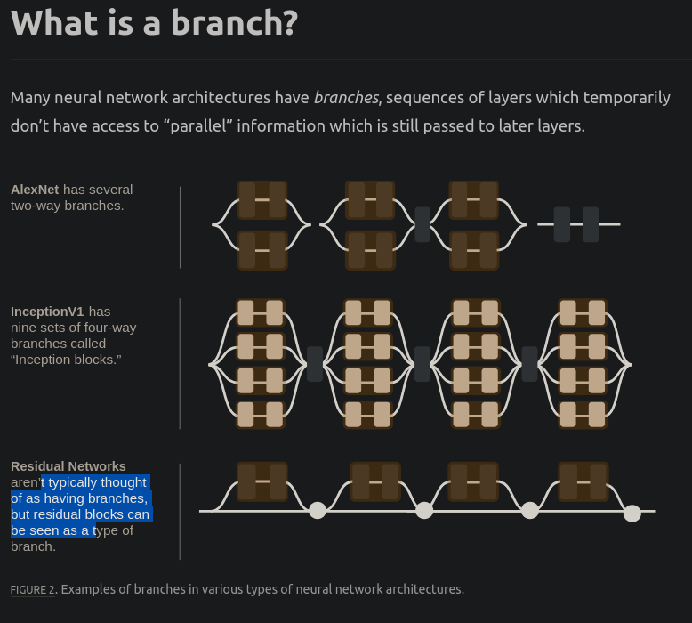
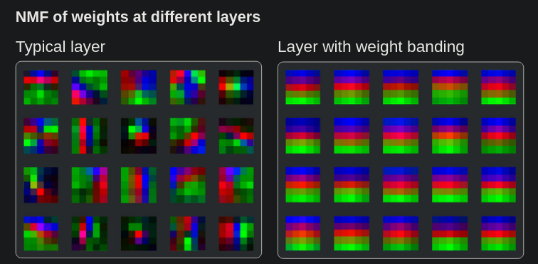
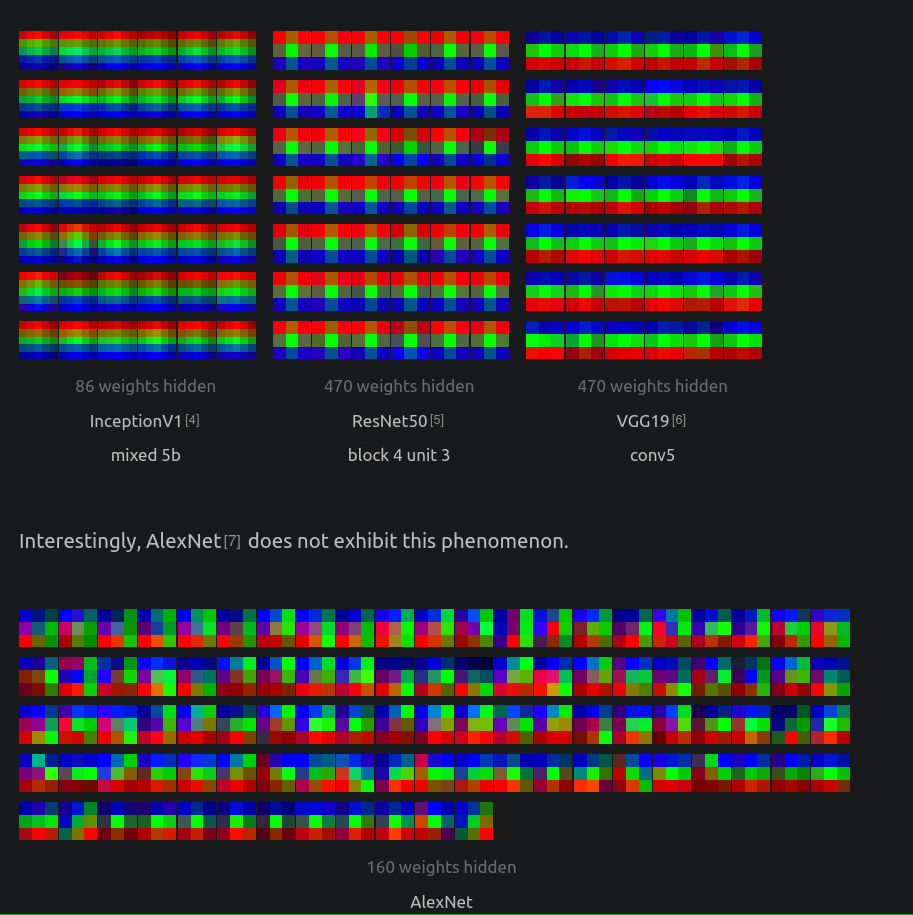

# Thread 1
- Introduces the concept of features, circuits
- Then the paper talk about universality of some features and circuits in neural networks.
- 

# Thread 2
- uses inceptionV1 as the foundational model to perform interpretability research
- The first conv layer of every vision model we’ve looked at is mostly comprised of two kinds of features: color-contrast detectors and Gabor filters
- This paper talks about what are the features that they observed in the first five layers of inceptionV1
- Features often seem to form in families

# Thread 3: Curve Detectors
- `Each curve detector implements a variant of the same algorithm: it responds to a wide variety of curves, preferring curves of a particular orientation and gradually firing less as the orientation changes. Curve neurons are invariant to cosmetic properties such as brightness, texture, and color`
- Curve detectors have sparse activations, firing in response to only 10% of spatial positions Receptive-field sized crops of an image. across ImageNet, and usually activating weakly when they do fire.
- When they activate strongly, it's in response to curves with similar orientation and curvature to their feature visualization

# Thread 4: Naturally Occurring Equivariance in Neural Networks
- In CNNs, features often occur in symmetric manner - This includes rotated copies of the same feature, scaled copies, flipped copies, features detecting different colors, and much more.
- Equivariant Features
  - Rotational Equivariance
  - Scale Equivariance
  - Hue Equivariance
  - Hue-Rotation Equivariance
  - Reflection Equivariance: As we move into the mid layers of the network, rotated variations become less prominent, but horizontally flipped pairs become quite prevalent. 
  - Miscellaneous Equivariance: Finally, we see variations of features transformed in other miscellaneous ways
- Equivariant Circuits: like features, there are circuits
  - High-Low Circuit
  - Contrast→Center Circuit
  - BW-Color Circuit
  - Line→Circle/Divergence Circuit
  - Human-Animal Circuit
- Equivariance has a remarkable ability to simplify our understanding of neural networks. When we see neural networks as families of features, interacting in structured ways, understanding small templates can actually turn into understanding how large numbers of neurons interact. Equivariance is a big help whenever we discover it. 

# Thread 5: High-Low Frequency Detectors
- `One worry we might have about the circuits approach to studying neural networks is that we might only be able to understand a limited set of highly-intuitive features.`
- Their most important role seems to be supporting boundary detectors, but they also contribute to bumps and divots, line-like and curve-like shapes, and at least one each of center-surrounds, patterns, and textures. 
- They are highly universal - present in almost all models and tasks we’ve looked at.

# Thread 6: Curve Circuits
- The authors learns the curve circuits and then implements it in a new model

# Thread 7: Visualizing Weights
- Researchers do not generally visualize weights
- Sometimes meaningful interactions between neurons might happen between neurons that are far away
- They expand weights to understand it

# Thread 8: Branch Specialization :)
- The authors look for "organs" in the network that are larger than circuits - they call them branch specialization
- `The earliest example of branch specialization that we’re aware of comes from AlexNet. AlexNet is famous as a jump in computer vision, arguably starting the deep learning revolution, but buried in the paper is a fascinating, rarely-discussed detail. The first two layers of AlexNet are split into two branches which can’t communicate until they rejoin after the second layer. This structure was used to maximize the efficiency of training the model on two GPUs, but the authors noticed something very curious happened as a result. The neurons in the first layer organized themselves into two groups: black-and-white Gabor filters formed on one branch and low-frequency color detectors formed on the other branch`

- Residual connections can also be (in some sense) conceptualised as branches
- Perhaps the most surprising thing about branch specialization is that the same branch specializations seem to occur again and again, across different architectures and tasks. 

# Thread 9: Weight Banding
- A phenomenon that the authors observed in the last layers of image models, in which the weights appear to 'band' together.

- In the case of weight banding, we think of it as a structural phenomenon because the pattern appears at the scale of an entire layer. 
- Weight banding consistently forms in the final convolutional layer of vision models with global average pooling. 
- AlexNet does not have a pooling operation before its fully connected layers and does not show banding at its last convolutional layer. If one looks at the weights of this fully connected layer, the weights strongly vary as a function of the global y position. 

- The horizontal stripes in weight banding mean that the filters don't care about horizontal position, but are strongly encoding relative vertical position. Our hypothesis is that weight banding is a learned way to preserve spatial information as it gets lost through various pooling operations. 
- They also trained a model with the images rotated 90 degrees. This resulted in the bands being vertical
- `The use of aggressive pooling after the last convolutions in common models causes weight banding.`
- Authors tried many other modifications to see when and where banding appears.
- It’s unclear whether weight banding is “good” or “bad.” However, it is an example of a consistent link between architecture decisions and the resulting trained weights.