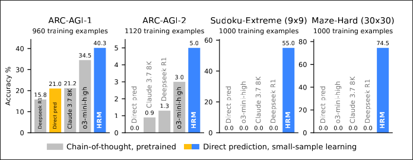

# Heirarchical Reasoning Models (HRM)
- Sapient Intelligence, Singapore

# What does it do?
- Classic LLMs struggle with reasoning tasks that require multiple steps or complex logic.
- Inspired from human brain
- Got insane benchmark scores from a 27M parameter model with zero pretraining and only a 1000 training samples

# What is it?
- 
- Language is a tool for human communication, not the substrate of thought itself . You dont have to use language to think, like reasoning models use.
- It features two coupled recurrent modules: a high-level (H) module for abstract,
deliberate reasoning, and a low-level (L) module for fast, detailed computations.This structure avoids the rapid convergence of standard recurrent models through a process we term “hierarchical convergence.” The slow-updating H-module advances only after the fast-updating L-module has completed multiple computational steps and reached a local equilibrium, at which point the L-module is reset to begin a new computational phase.

There is a slow planner(H) and a fast executor(L). The H gives a high-level task for L to do. The L is superfast and does multiple fast iterations to do the task. Note that all this happens within the network in one go, and the model actually runs only once for the whole task. So if it is an LLM, then all the task will be performed in one go.
The H provides a stable guiding signal for L.

- does this thing scale well
- can i use this to make an LLM
  - or can i use this as a tool to assist LLM reasoning
- H will run for N steps and L will run for T steps, but who decides N and T?
  
