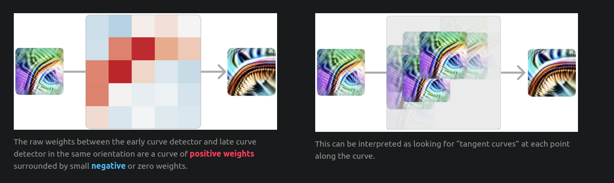

# Zoom In: An Introduction to Circuits
- OpenAI, March 10, 2020
- Circuits Threads: 1

`By studying the connections between neurons, we can find meaningful algorithms in the weights of neural networks.`

# Introduction
- Most interpretability research focuses on understanding what a NN as a whole is trying to do
- In these papers, the researchers try to understand the working of individual neurons in a NN, by spending time tracing throught the connections between neurons.
- The researchers found that the weights of a NN can be interpreted as a circuit, which is a sequence of operations that transform input data into output data.
- In contrast to the typical picture of neural networks as a black box, we’ve been surprised how approachable the network is on this scale.

# Three Speculative Claims about Neural Networks

## Claim 1: Features
- Features are the fundamental unit of neural networks. They correspond to directions (in a vector space)
- Early layers contain features like edge or curve detectors, while later layers have features like floppy ear detectors or wheel detectors.
- Features are the representations or concepts that a model has learned to recognize and represent internally. These can range from low-level features (like edges or textures in early layers of a vision model) to high-level features (like objects or abstract ideas in later layers).
- They typically are made with one or a few number of neurons.

Examples
- The paper claim that `curve detection features` exist in NNs. They are very intuitive to find and understand.
- There are also features that are less intuitive. High-low frequency detectors are an example of a less intuitive type of feature. They look for low-frequency patterns on one side of their receptive field, and high-frequency patterns on the other side. 

## Claim 2: Circuits
- A “circuit” is a computational subgraph of a neural network. It consists of a set of features, and the weighted edges that go between them in the original network.
- Circuits refer to the mechanisms or pathways by which features are computed and combined across multiple neurons and layers in the network. 
- They are essentially the "wiring" or interconnections between neurons that implement specific computations or decision-making processes.
- As an eg, the paper explains a new curve detector formed from earlier curve detectors features. This new curve detector is a circuit.
- This weights in the neurons for the curve dectector looks like this: (big weights in the shape of a curve)[
This can be interpreted as looking for “tangent curves” at each point along the curves. This is true for every pair of early and full curve detectors in similar orientations.]

- In another example, the model creates two 4-layer long pathways(circuit) to detect the presence of dog's head in left and right orientations respectively. Both these pathways ran in parallel and inhibited each other.
- Another eg shows multiple layer long car detection circuit which looks for wheels at the bottom and windows at the top(and inhibiting each other). After that, instead of summing all this up and creating a car detection neuron, the model creates multiple car detection neurons, polysemantic with dog detection :o
- `This circuit suggests that polysemantic neurons are, in some sense, deliberate. That is, you could imagine a world where the process of detecting cars and dogs was deeply intertwined in the model for some reason, and as a result polysemantic neurons were difficult to avoid. But what we’re seeing here is that the model had a “pure neuron” and then mixed it up with other features.'`
- We call this phenomenon superposition. Why would it do such a thing? We believe superposition allows the model to use fewer neurons, conserving them for more important tasks. As long as cars and dogs don't co-occur, the model can accurately retrieve the dog feature in a later layer, allowing it to store the feature without dedicating a neuron.

## Claim 3: Universality
- Analogous features and circuits form across models and tasks.
- `If it was true in the strongest sense, one could imagine a kind of “periodic table of visual features” which we observe and catalogue across models.`

# Note
1. Polysemantic neurons: Neurons that respond to multiple unrelated inputs.`Our hope is that it may be possible to resolve polysemantic neurons, perhaps by “unfolding” a network to turn polysemantic neurons into pure features, or training networks to not exhibit polysemanticity in the first place. 